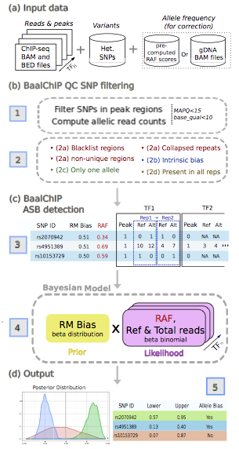

```{r style, echo=FALSE, results="asis", message=FALSE}
BiocStyle::markdown()
knitr::opts_chunk$set(tidy = FALSE,
                      warning = FALSE,
                      message = FALSE)
```

```{r echo=FALSE, results='hide', message=FALSE}
library(BaalChIP)
```


# Citation

If you use `r Biocpkg("BaalChIP")` in published research, please cite [@desantiago2016]. 

```
de Santiago I, Liu W, Yuan K, O'Reilly M, Chilamakuri CS, ponder BJ, Meyer K, Markowetz F.
BaalChIP: Bayesian analysis of allele-specific transcription factor binding in cancer genomes.
in press. 2016.
```

<!--URL: []() --> 


# Introduction

BaalChIP is a rigorous statistical method to identify allele-specific binding of transcription factors, which is important, for example, to understand the functional consequences of the many disease-risk associated SNPs occurring in non-coding DNA. 
`r Biocpkg("BaalChIP")` (Bayesian Analysis of Allelic imbalances from ChIP-seq data) comprehensively combines a strict filtering and quality-control pipeline for quality control with a Bayesian statistical model that corrects for biases introduced by overdispersion, biases towards the reference allele, and most importantly, differences in allele frequencies due to copy number changes (Figure 1).


**Figure 1: Description of BaalChIP model frame work.** **(a)** The basic inputs for Baal are the ChIP-seq raw read counts in a standard BAM alignment format, a BED file with the genomic regions of interest (such as ChIP-seq peaks) and a set of heterozygous SNPs in a tab-delimited text file. Optionally, genomic DNA (gDNA) BAM files can be specified for RAF computation, alternatively, the user can specify the pre-computed RAF scores for each variant. **(b)** The first module of BaalChIP consists of (1) computing allelic read counts for each heterozygous SNP in peak regions and (2) a round of filters to exclude heterozygous SNPs that are susceptible to generating artifactual allele-specific binding effects. (3) the Reference Mapping (RM) bias and the Reference Allele Frequency (RAF) are computed internally and the output consists of a data matrix where RM and RAF scores are included alongside the information of allele counts for each heterozygous SNP. The column 'Peak' contains binary data used to state the called peaks.
**(c)** The second module of BaalChIP consists of calling ASB binding events. (4) BaalChIP uses a beta-binomial Bayesian model to consider RM and RAF bias when detecting the ASB events. **(d)** The output from BaalChIP is a posterior distribution for each SNP. A threshold to identify SNPs with allelic bias is specified by the user (default value is a 95\% interval). (5) Finally, a credible interval ('Lower' and 'Upper') calculated based on the posterior distribution. This interval corresponds to the true allelic ratio in read counts  (i.e. after correcting for RM and RAF biases). An ASB event is called if the lower and upper limits of the interval are outside the 0.4-0.6 interval.

# Standard workflow

## Quick start: example 1 (with pre-computed RAF scores)

The first example dataset consists of ChIP-seq data obtained from two cell lines: A cancer cell-line (MCF7) and a normal cell line (GM12891). In this example dataset, pre-computed reference allele frequency (RAF) scores are used to correct the allelic read counts for biases caused by copy number alterations.

The first step in a BaalChIP analysis pipeline is to construct a _BaalChIP_ class object:

```{r, eval=TRUE}
wd <- system.file("test",package="BaalChIP") #system directory

samplesheet <- file.path(wd, "exampleChIP1.tsv")
hets <- c("MCF7"="MCF7_hetSNP.txt", "GM12891"="GM12891_hetSNP.txt")
res <- BaalChIP(samplesheet=samplesheet, hets=hets)
```

Given a new BaalChIP object, to run a BaalChIP analysis and identify allele-specific binding events, type:

```{r quick1, eval=FALSE}
res <- BaalChIP(samplesheet=samplesheet, hets=hets)
res <- BaalChIP.run(res, cores=4, verbose=TRUE) #cores for parallel computing
```

> Note that the example data in this vignette does not reveal real biology and was build only for demonstration purposes.

## Quick start: example 1 with more control over the input options

We have shown a typical analysis pipeline performed with the wrapper function `BaalChIP.run`.
If you wish to have more control over the input options, the same analysis above can be performed with various commands as follows:


```{r quick2, eval=FALSE}

#create BaalChIP object
samplesheet <- file.path(wd, "exampleChIP1.tsv")
hets <- c("MCF7"="MCF7_hetSNP.txt", "GM12891"="GM12891_hetSNP.txt")
res <- BaalChIP(samplesheet=samplesheet, hets=hets)

#Now, load some data
data(blacklist_hg19)
data(pickrell2011cov1_hg19)
data(UniqueMappability50bp_hg19)

#run one at the time (instead of BaalChIP.run)
res <- alleleCounts(res, min_base_quality=10, min_mapq=15, verbose=FALSE)
res <- QCfilter(res, 
                RegionsToFilter=c("blacklist_hg19", "pickrell2011cov1_hg19"),            
                RegionsToKeep="UniqueMappability50bp_hg19",
                verbose=FALSE)
res <- mergePerGroup(res)
res <- filter1allele(res)
res <- getASB(res, 
              Iter=5000, 
              conf_level=0.95, 
              cores=4, RMcorrection = TRUE, 
              RAFcorrection=TRUE)
```

The following sections describe all these steps in more detail.

## Quick start: example 2 (with gDNA BAM files)

The second dataset contains ChIP-seq and genomic DNA (gDNA) data obtained from two ChIP-seq studies. In this example, the allelic-ratios obtained from the sequenced gDNA samples are used to correct the allelic read counts for biases caused by copy number alterations.

First, we create a named list of filenames for the '.bam' gDNA files to be used. The names in the list ("TaT1" and "AMOVC") should correspond to *group_name* strings in the samplesheet.
  
```{r}
gDNA <- list("TaT1"=
               c(file.path(wd, "bamFiles/TaT1_1_gDNA.test.bam"),
                 file.path(wd, "bamFiles/TaT1_2_gDNA.test.bam")),
              "AMOVC"=
               c(file.path(wd, "bamFiles/AMOVC_1_gDNA.test.bam"),
                 file.path(wd, "bamFiles/AMOVC_2_gDNA.test.bam")))
```

Now we can run BaalChIP pipeline as before. Note that we include the path to the gDNA files in the `CorrectWithgDNA` argument:

```{r quick3, eval=FALSE}
wd <- system.file("test",package="BaalChIP") #system directory

samplesheet <- file.path(wd, "exampleChIP2.tsv")
hets <- c("TaT1"="TaT1_hetSNP.txt", "AMOVC"="AMOVC_hetSNP.txt")
res2 <- BaalChIP(samplesheet=samplesheet, hets=hets, CorrectWithgDNA=gDNA)
res2 <- BaalChIP.run(res2, cores=4, verbose=TRUE) #cores for parallel computing
```

> Note that the example data in this vignette does not reveal real biology and was build only for demonstration purposes.

## Input data

### The sample sheet

In order to run BaalChIP, one needs to generate a *sample sheet* describing the samples and the groups within each study. This file should be saved as a tab-delimited file. The extension of this file is not important, for example it can be *.txt* as long as it is a tab-delimited file.
Two example *.tsv* sample sheets have been included in this vignette and can be assessed as follows:

```{r}
samplesheet <- read.delim(file.path(wd,"exampleChIP1.tsv"))
samplesheet
```

This sample sheet details the metadata for ChIP-seq studies in MCF7 and GM12891 cell lines. For each study, ChIP-seq data exists for four transcription factors and 2 replicates each (hence, 16 BAM files). 

1. The first column `group_name` identifies the group label of each study (MCF7, GM12891). 
2. The second column `target` corresponds to the name of the transcription factor.
3. The column `replicate_number` shows that there are two biological replicates for each ChIP-seq factor. 
4. `bam_name` corresponds to the file paths to the BAM files with the aligned reads.
5. `bed_name` corresponds to the file paths to the BED files with the genomic regions of signal enrichment that the user is interested in (typically these are the ChIP-seq peaks files). For each TF ChIP-seq sample, BaalChIP will only test SNPs overlapping these defined genomic intervals of interest.

Here is another example sample sheet:

```{r}
samplesheet <- read.delim(file.path(wd,"exampleChIP2.tsv"))
samplesheet
```

This sample sheet details the metadata for ChIP-seq studies in TaT1 and AMOVC experimental groups. For each study, ChIP-seq data exists for one transcription factors and 2 replicates each (hence, 4 BAM files). 

### The hets files

BaalChIP requires a *variant file* containing the list of heterozygous variants to be analysed. As an example, *hets* files have been included in this vignette and can be assessed as follows:

```{r}
head(read.delim(file.path(system.file("test",package="BaalChIP"),"MCF7_hetSNP.txt")))
```

The information in the variant file includes:

1. `ID` column with a unique identifier string per variant. 
2. (1-based) genomic coordinates `CHROM, POS`.
3. A,C,G,T bases for the reference `REF` and the non-reference alternate `ALT` allele. 
4. The final column `RAF` is optional. RAF scores consist of values ranging from 0 to 1 for each variant denoting the reference allele frequency. A value between 0.5 and 1 denotes a bias to the reference allele, and a value between 0 and 0.5 a bias to the alternate allele. This column is optional, and will not be necessary if ask BaalChIP to calculate the RAF values from the input gDNA libraries (by using `CorrectWithgDNA` argument of the BaalChIP-class constructor function `BaalChIP` - see below). 

### The gDNA BAM files

The gDNA BAM files are input genomic DNA sequencing files for the corresponding groups in the ChIP-seq test data. These BAM files are passed to BaalChIP through the `CorrectWithgDNA` argument of the BaalChIP-class constructor function `BaalChIP`.

Allelic read counts from all gDNA files will be pooled together to generate the background allelic ratios directly from input data. 

## Constructing a BaalChIP object

The first step is to generate a BaalChIP object. The function `BaalChIP` accepts the following arguments: 

1. `samplesheet`: A character string indicating the file name for a tab-delimited file. 
2. `hets`: A named vector with filenames for the variant files to be used. The names in the vector should correspond to the `group_name` strings in the samplesheet.
3. `CorrectWithgDNA`: An optional named list with filenames for the BAM gDNA files to be used. The names in the vector should correspond to `group_name` strings in the samplesheet. If the `CorrectWithgDNA` argument is missing or set to NULL, BaalChIP will try to read the reference allelic ratios from the information in the RAF column of the *hets* files indicated by the `hets` argument. If both (RAF column and `CorrectWithgDNA`) are missing, BaalChIP will not correct for copy-number bias. 

```{r, eval=TRUE}
samplesheet <- file.path(wd,"exampleChIP1.tsv")
hets <- c("MCF7"="MCF7_hetSNP.txt", "GM12891"="GM12891_hetSNP.txt")
res <- BaalChIP(samplesheet=samplesheet, hets=hets)
res
```

The *samplesheet* and *hets* information are saved in the `samples` slot of a BaalChIP object:

```{r}
BaalChIP.get(res, what="samples")
```

## Obtaining allele-specific counts for BAM files

The next step is to compute for each SNP the number of reads carrying the reference (REF) and alternative (ALT) alleles. The `alleleCounts` function will read and scan all BAM files  within the `samples` slot of a BaalChIP object and compute the read coverage at each allele. Allele counts are computed using the `pileup` function of the `r Biocpkg("Rsamtools")` package [@morganrsamtools]. 

Note that for each BAM file, it will only consider heterozygous SNPs overlapping the genomic regions in the corresponding BED files. 

Two arguments can be manipulated by the user: 

1. `min_mapq` refers to the minimum "MAPQ" value for an alignment to be included in pileup (default is 15). 
2. `min_base_quality` refers to the minimum "QUAL" value for each nucleotide in an alignment (default is 10).

```{r, eval=TRUE}
#run alleleCounts
res <- alleleCounts(res, min_base_quality=10, min_mapq=15, verbose=FALSE)
```


## QCfilter: A filter to exclude SNPs in regions of known problematic read alignment

After computing the read counts per allele, the next step in the BaalChIP pipeline is an extensive quality control to consider technical biases that may contribute to the false identification of regulatory SNPs.

The function `QCfilter` is used to excluded sites susceptible to allelic mapping bias in regions of known problematic read alignment [@fujita2010ucsc] [@pickrell2011false] [@castel2015tools] [@carroll2014impact]. 

This function accepts two arguments: 

1. `RegionsToFilter` a named list of GRanges objects with the genomic regions to be excluded
2. `RegionsToKeep` a named list GRanges object with the genomic regions to be kept. This works in an opposite way to 'RegionstoFilter', variants NOT overlapping these regions will be removed

Sets of filtering regions used in this step are fully customized and additional sets can be added by the user as `r Biocpkg("GenomicRanges")` objects [@lawrence2013software].

Three sets of regions are included with BaalChIP package for the hg19 reference of the human genome: 

```{r}
data(blacklist_hg19)
data(pickrell2011cov1_hg19)
data(UniqueMappability50bp_hg19)
```

1. `blacklist_hg19` contains blacklisted genomic regions downloaded from the mappability track of the UCSC Genome Browser [@fujita2010ucsc] (hg19, wgEncodeDacMapabilityConsensusExcludable and wgEncodeDukeMapabilityRegionsExcludable tables). These correspond to artifact regions that tend to show artificially high signal (excessive unstructured anomalous reads mapping). These regions should be used as `RegionsToFilter` so that variants overlapping these regions will be removed. Note that these blacklists are applicable to functional genomic data (e.g. ChIP-seq, MNase-seq, DNase-seq, FAIRE-seq) of short reads (20-100bp reads). These are not applicable to RNA-seq or other transcriptome data types. 
2. `pickrell2011cov1_hg19` contains collapsed repeat regions at the 0.1\% threshold [@pickrell2011false]. These regions should also be  used as `RegionsToFilter`.
3. `UniqueMappability50bp_hg19` contains unique regions with genomic mappability score of 1, selected from DUKE uniqueness mappability track of the UCSC genome browser generated using a window size of 50bp (hg19,  wgEncodeCrgMapabilityAlign50mer table). These regions should be used as `RegionsToKeep` so that variants NOT overlapping these regions will be removed. No applicable to longer reads (> 50bp)


```{r, eval=TRUE}
#run QC filter
res <- QCfilter(res, 
                RegionsToFilter=list("blacklist"=blacklist_hg19, "highcoverage"=pickrell2011cov1_hg19), 
                RegionsToKeep=list("UniqueMappability"=UniqueMappability50bp_hg19), 
                verbose=FALSE)
res <- mergePerGroup(res)
res <- filter1allele(res)
```

## filterIntbias: A simulation-based filtering to exclude SNPs with intrinsic bias

The function `filterIntbias` can be used to apply a simulation-based filtering to exclude SNPs with intrinsic bias to one of the alleles [@degner2009effect] [@pickrell2010understanding].
This bias occurs due to intrinsic characteristics of the genome that translate into different probabilities of read mapping. 
Even when reads differ only in one location, reads carrying one of the alleles may have a higher chance of matching multiple locations (i.e. have many repeats in the genome) and may therefore be mapped to an incorrect locus. 
This, in turn, results in the underestimation of read counts and may cause both false-positive and false-negative inferences of ASB. 

This filter performs the following steps:

1. Performs simulations of reads of the same length as the original ChIP-seq reads. For each heterozygous site, BaalChIP simulates every possible read overlapping the site in four possible combinations - reads carrying the reference allele (plus and minus strand), and reads carrying the alternative allele (plus and minus strand). The simulated reads are constructed based on published methodology [@degner2009effect] (scripts shared by the author upon request) without taking into consideration different qualities at each base in the read or different read depth of coverage. As described by [@degner2009effect] these parameters were sufficient to predict the SNPs that show an inherent bias. 
2. Simulated reads are aligned to the reference genome and generates BAM files. The pipeline used to generate and align simulated reads is given by an external script file and it is available under the file name `run_simulations.sh` found in the folder `extra` of the BaalChIP R package. The alignment pipeline can be fully customized by the user (e.g. with other aligners, etc)
3. Allelic read counts are computed using the `pileup` function of the `r Biocpkg("Rsamtools")` package [@morganrsamtools]. 
4. SNPs with incorrect number of read alignments are eliminated (i.e SNPs with allelic counts different than twice the read length for each allele). 

The default `run_simulations.sh` script can be found here:

`r file.path(system.file("test",package="BaalChIP"), 'extra/simulation_run.sh')`

> Note: Since we are using an artificial example dataset, this filter will not give meaningful results.

This is how the command to run this filtering step would look like: 

```{r, eval=FALSE, message=FALSE, error=FALSE, warning=FALSE}

res <- filterIntbias(res, 
                     simul_output="directory_name", 
                     tmpfile_prefix="prefix_name", 
                     simulation_script = "local",
                     alignmentSimulArgs=c("picard-tools-1.119",
                                          "bowtie-1.1.1",
                                          "genomes_test/male.hg19",
                                          "genomes_test/maleByChrom")
                     verbose=FALSE)
```

The function accepts three arguments:

1. `simul_output` allows the user to specify the name of the directory of where to save the generated simulated FASTQ and BAM files. if NULL or missing, a random directory under the current working directory will be generated
2. `tmpfile_prefix` argument is a character vector giving the initial part of the name of the FASTQ and BAM files generated by the function. If NULL or missing, a random prefix name will be generated.
3. `simulation_script` the file path for simulation script containing the instructions of simulation and alignment commands. If set to 'local', the default simulation script distributed with BaalChIP ('extra/simulation_run.sh') will be used. Otherwise the user can specify the path to their own simulation scripts.
4. `alignmentSimulArgs` this is a vector of character with arguments passed to the sumulation_run.sh script. There are four arguments: the complete path to the picard software, the complete path to the bowtie aligner, the basename of the indexed genome files, and finally A path to the folder containing gzipped files of the genome, separated by chromosome and named as: chr1.fa.gz, chr2.fa.gz, chr3.fa.gz, etc.

### skipScriptRun

For demonstration purposes, we have saved the output of the previous command in a external folder:

`r system.file("test/simuloutput",package="BaalChIP")`

We can have a look at the saved files:

```{r}
preComputed_output <- system.file("test/simuloutput",package="BaalChIP")
list.files(preComputed_output)
```

By specifying `skipScriptRun=TRUE`, BaalChIP will take the simulated reads allelic ratios directly from the pre-computed simulated datasets and use them for further filtering. This way, the simulation (step 1) and alignment (step 2) steps will be skipped.

For this particular example we can run:

```{r, eval=TRUE}
res <- filterIntbias(res, simul_output=preComputed_output, 
                     tmpfile_prefix="c67c6ec6c433", 
                     skipScriptRun=TRUE,
                     verbose=FALSE)
```

## Merge allele counts per group

The function `mergePerGroup` is used select those SNPs that pass all filters in all replicated samples, provided that replicated samples exist. This QC step will mainly remove SNPs in regions where the ChIP-seq signal is not consistently detected across all replicates (for instance when coverage is zero in one of the replicates). 

```{r}
res <- mergePerGroup(res)
```

## Removing possible homozygous SNPs

The final filtering step consists of removing possible homozygous SNPs by removing any site where only one allele is observed [@lappalainen2013transcriptome] [@kilpinen2013coordinated]. The function `filter1allele` will perform this step by pooling ChIP-seq reads from all examined samples and then eliminating those SNPs that contain no data (zero counts) for one of the alleles.

```{r}
res <- filter1allele(res)
```

## Identifying allele-specific binding events 

BaalChIP uses a Bayesian framework to infer allelic imbalance from read counts data while integrating copy number and technical bias information. BaalChIP applies a beta-binomial distribution to model read count data therefore accounting for extra variability (over-dispersion) in allelic counts, a phenomenon that is often observed in sequencing data [@pickrell2010understanding] [@skelly2011powerful]. 

To run the ASB detection step type:

```{r, eval=FALSE, message=FALSE}
res <- getASB(res, Iter=5000, conf_level=0.95, cores = 4, 
              RMcorrection = TRUE, 
              RAFcorrection=TRUE)
```

At this step, BaalChIP considers two additional biases that may lead to inaccurate estimates of ASB: the reference mapping (RM) and the reference allele frequency (RAF) biases.

### The reference mapping (RM) bias

The RM bias occurs because the reference genome only represents a single "reference" allele at each SNP position. 
Reads that carry the "non-reference allele" have an extra mismatch to the reference sequence. Previous work has shown that this creates a marked bias in favor of the alignment of reads that contain the reference genome and could therefore affect the accuracy of allele-specific binding estimates [@degner2009effect].
The reference mapping bias is calculated as described in [@lappalainen2013transcriptome] and [@kilpinen2013coordinated]. 

This bias correction can be turned on/off by using the argument `RMcorrection=TRUE` or `RMcorrection=FALSE` of the `getASB` function

### The relative allele frequency (RAF) bias

The RAF bias occurs due to alterations in the background abundance of each allele (e.g. in regions of copy-number alterations) and the correction for this bias is one of the key features of BaalChIP. 

RAF values at each heterozygous variant are used in the model likelihood to correct of the observed ChIP-seq read counts relative to the amount of the reference allele. 
These are given as relative measures from 0 to 1, where values between 0.5 and 1 denote an underlying bias to the reference allele, and a value between 0 and 0.5 to the alternative allele. 

This bias correction can be turned on/off by using the argument `RAFcorrection=TRUE` or `RAFcorrection=FALSE` of the `getASB` function

## Exporting the results

### BaalChIP.report

The output of BaalChIP is a posterior distribution of the estimated allelic balance ratio in read counts observed after considering all sources of underlying biases

```{r}
res
```

The function `BaalChIP.report` outputs a list with a table per group with the final results:

```{r}
result <- BaalChIP.report(res)
head(result[["MCF7"]])
```

The reported data frame contains the following columns:

1. `ID`: unique identifier string per analysed variant.
2. `CHROM`: chromosome identifier from the reference genome per variant.
3. `POS`: the reference position (1-based).
4. `REF`: reference base. Each base must be one of A,C,G,T in uppercase.
5. `ALT`: alternate non-reference base. Each base must be one of A,C,G,T in uppercase.
6. `REF.counts`: pooled counts of all reads with the reference allele.
7. `ALT.counts`: pooled counts of all reads with the non-reference allele.
8. `Total.counts`: pooled counts of all reads (REF + ALT).
9. `AR`: allelic ratio calculated directly from sequencing reads (REF / TOTAL).
10. `RMbias`: numerical value indicating the value estimated and applied by BaalChIP for the reference mapping bias. A value between 0.5 and 1 denotes a bias to the reference allele, and a value between 0 and 0.5 a bias to the alternative allele.
11. `RAF`: numerical value indicating the value applied by BaalChIP for the relative allele frequency (RAF) bias correction. A value between 0.5 and 1 denotes a bias to the reference allele, and a value between 0 and 0.5 a bias to the alternative allele.
12. `Bayes_lower`: lower interval for the estimated allelic ratio (allelic ratio is given by REF / TOTAL).
13. `Bayes_upper`: upper interval for the estimated allelic ratio (allelic ratio is given by REF / TOTAL).
14. `Corrected.AR`: average estimated allelic ratio (average between Bayes_lower and Bayes_upper). A value between 0.5 and 1 denotes a bias to the reference allele, and a value between 0 and 0.5 a bias to the alternative allele.
15. `isASB`: logical value indicating BaalChIP's classification of variants into allele-specific.

# Sumarizing and plotting data 

## The ENCODE data set

We applied BaalChIP to 548 samples from the ENCODE project [@encode2012integrated]. In total 271 ChIP-seq experiments were analyzed, assaying a total of 8 cancer and 6 non-cancer cell lines representing different tissues. The data contained either 2 or 3 replicates per experiment and 4 to 42 DNA-binding proteins per cell line.

To load the ENCODEexample object type:
```{r}
data(ENCODEexample)
ENCODEexample
```

## The FAIREseq data set

To demonstrate the generality of our approach, we applied BaalChIP to targeted FAIRE-sequencing data obtained from two breast-cancer cell lines, MDA-MB-134 and T-47D.
In this dataset, the sequenced gDNA samples were used for the RAF correction step, i.e. allelic ratios at each SNP position were calculated directly from gDNA samples and used for bias correction. 

## summaryQC: summary of QC result.

To ensure a reliable set of heterozygous SNPs we applied the BaalChIP QC step with the default parameters and options. 
The summary of the QC result can be viewed with the `summaryQC` function:

```{r}
a <- summaryQC(ENCODEexample)
```

This function outputs a list of two elements:

`filtering_stats` shows the number of variants that were filtered out in each filter category and the total number that 'pass' all filters

```{r}
summaryQC(ENCODEexample)[["filtering_stats"]]
```

`average_stats` shows the average number and average percentage of variants in each filter category, averaged across all analysed groups

```{r}
summaryQC(ENCODEexample)[["average_stats"]]
```

The `average_stats` shows that on average `r round(a[[2]][7,"perc"],2)`% of SNPs pass all filters, meaning that BaalChIP removed an average of `r round(100-a[[2]][7,"perc"],2)`% of all SNPs (with slight variation between cell lines).

## plotQC: Plot filtering results

We can visualize the summary of the QC step with three different plots.


`barplot_per_group` plots the number of variants that were filtered out per group.

```{r plotENCODE1}
plotQC(ENCODEexample, what="barplot_per_group")
```

`boxplot_per_filter` plots the number of variants that were filtered out per filter category.

```{r plotENCODE2}
plotQC(ENCODEexample, what="boxplot_per_filter")
```

`overall_pie` plots the average percentage of variants in each filter category (averaged across all groups analysed).

```{r plotENCODE3}
plotQC(ENCODEexample, what="overall_pie")
```

## Plot simulation results

The function `plotSimul` produces a plot of the proportion of SNPs that displayed the correct number of mapped simulated reads for the different read lengths considered in the ENCODE data set (28mer to 50mer). The percentage of correct calls increases with the sequencing length of the simulated reads.

```{r plotSimul}
plotSimul(ENCODEexample)
```


## Exporting the table of assayed SNPs and their allelic counts

The filtered SNPs and their allelic read counts are merged into a table with the total number of read counts in the reference (REF) and alternative (ALT) alleles. 
No data is entered (missing data, NA) if a SNP did not pass the previously applied QC step for that sample

This is the table that is used in the final allele-specific binding test.

```{r}
#ENCODE example
a <- BaalChIP.get(ENCODEexample, "assayedVar")[["MCF7"]]
a[1:5,1:5]

#FAIRE exmaple
a <- BaalChIP.get(FAIREexample, "assayedVar")[["MDA134"]]
a[1:5,]
```

## summaryASB function

The summary of the ASB Bayesian test can be obtained with the `summaryASB` function

This function outputs matrix containing the total number of allele-specific variants (TOTAL) and the number of variants allele-specific for the reference (REF) and alternate alleles (ALT).

```{r}
summaryASB(ENCODEexample)
```

For the FAIRE-seq dataset, we identified a total of 21 and 9 ASB SNPs in MDA-MB-134 and T-47D cells, respectively: 

```{r}
summaryASB(FAIREexample)
```

## Allelic ratios density plot

The function `adjustmentBaalPlot` produces a density plot of the distribution of allelic ratios (REF/TOTAL) before and after BaalChIP adjustment for RM and RAF biases.

We observed that after correction the allelic ratios become more evenly distributed around an average of 0.5. 
This effect is particularly notable in data obtained from cancer cell lines: 

```{r adjENCODE, fig.width=12}
adjustmentBaalPlot(ENCODEexample)
```

```{r adjFAIRE1, fig.width=7, fig.height=2.5}
adjustmentBaalPlot(FAIREexample)
```

The colours of the plot can be controlled with the `col` argument

```{r adjFAIRE2, fig.width=7, fig.height=2.5}
adjustmentBaalPlot(FAIREexample, col=c("cyan4","chocolate3"))
```

## Retrieving the RM and RAF scores estimated by BaalChIP

You can access the final `biasTable` with the estimated RM and RAF scores per variant and per group_name. These are the final scores used in BaalChIP's Bayesian model:

```{r}
biastable <- BaalChIP.get(ENCODEexample, "biasTable")
head(biastable[["K562"]])
```

```{r}
biastable <- BaalChIP.get(FAIREexample, "biasTable")
head(biastable[["T47D"]])
```

## Exporting the final ASB results with BaalChIP.report

The function `BaalChIP.report` generates a data.frame per group with all variants and a label for all identified allele-specific binding (ASB) variants.

For instance, to see the final results for the T47D cell line in the FAIRE-seq dataset:
```{r}
result <- BaalChIP.report(FAIREexample)[["T47D"]]

#show ASB SNPs
result[result$isASB==TRUE,]
```

## Bugs/Feature requests ##

If you have any, [let me know](https://github.com/InesdeSantiago/BaalChIP/issues).

# Session Information

Here is the output of `sessionInfo()` on the system on which this document was compiled:

```{r echo=FALSE}
sessionInfo()
```

# References

